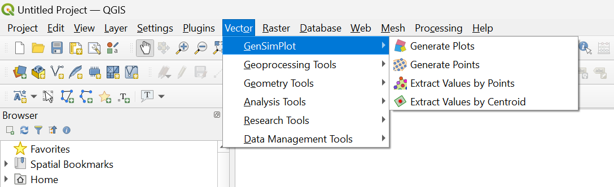
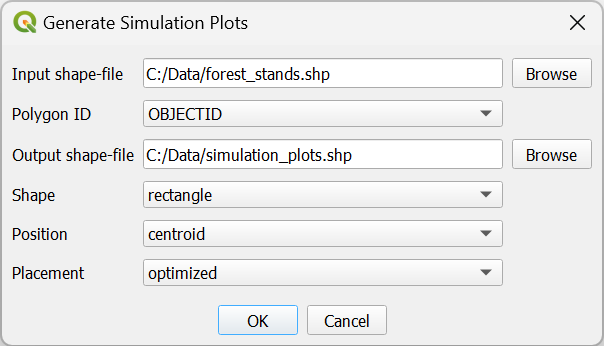
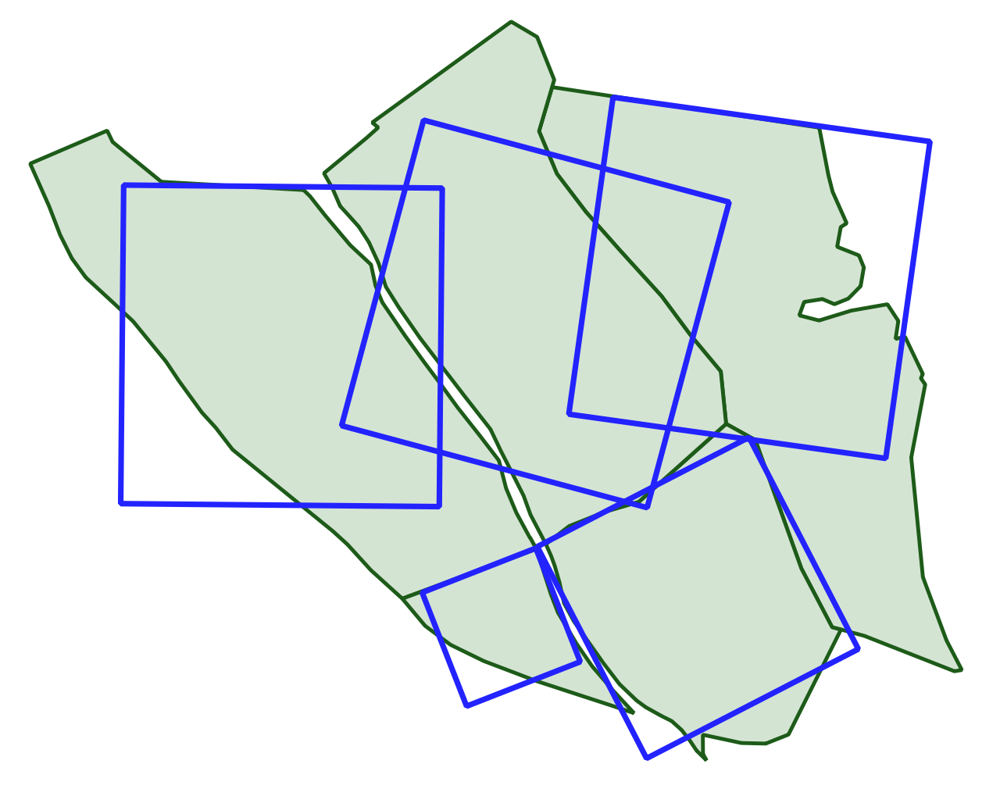
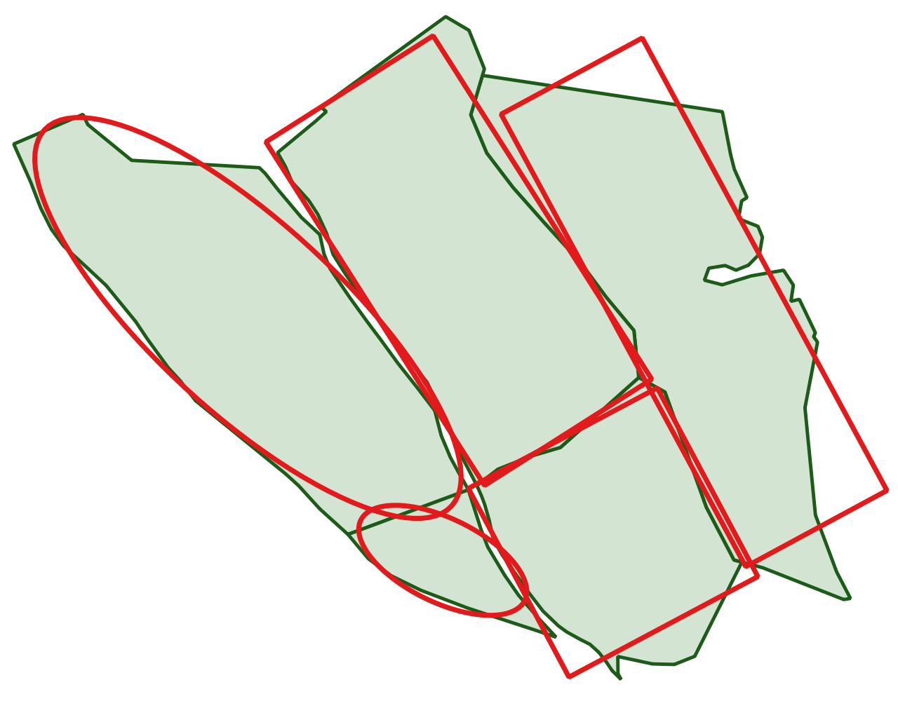
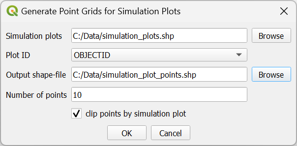
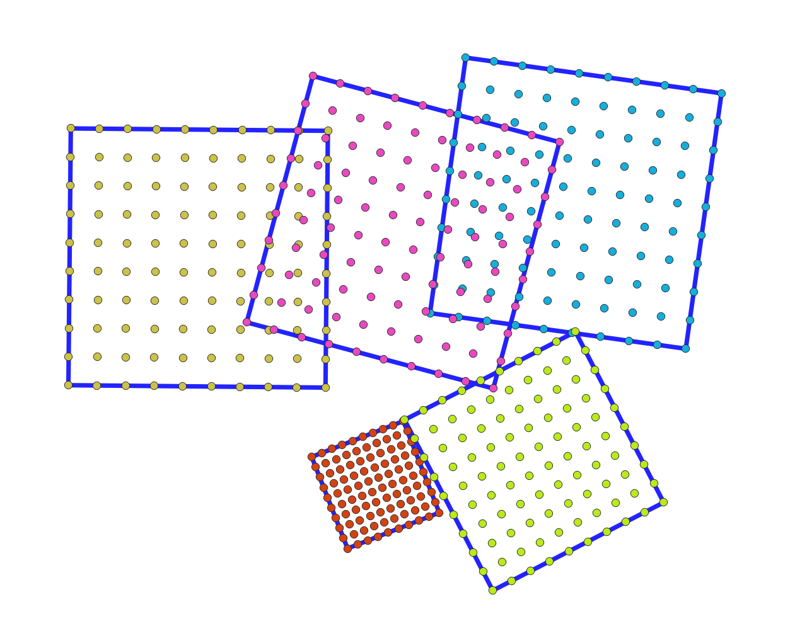
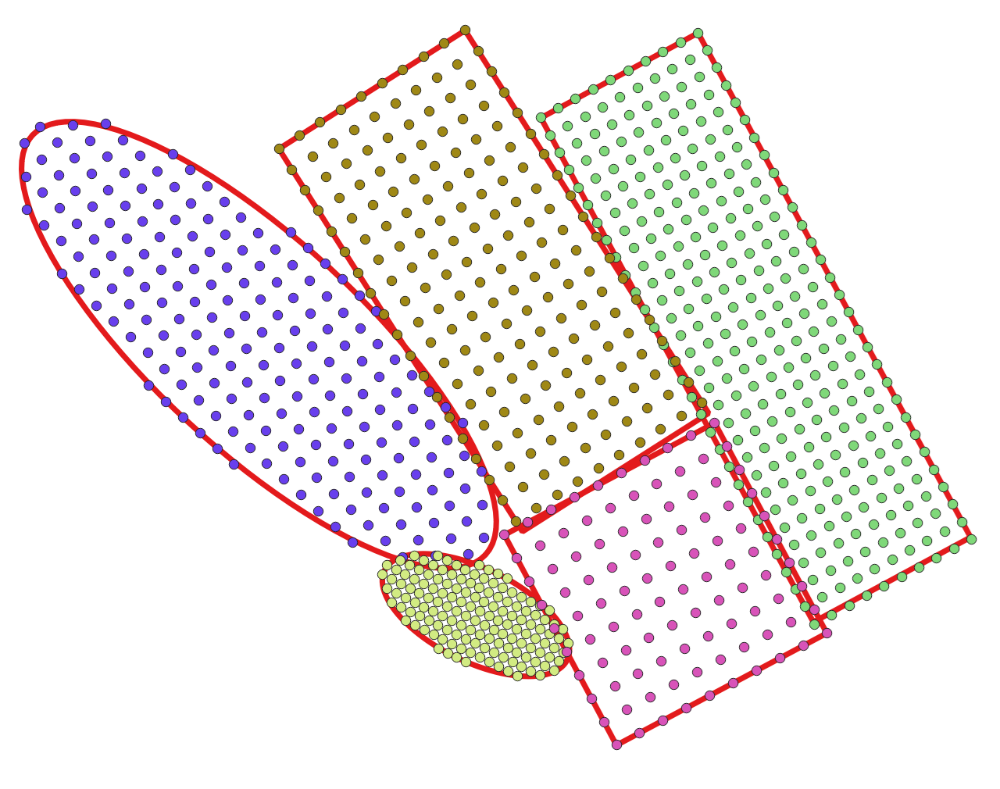
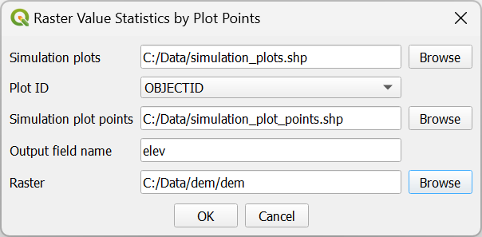
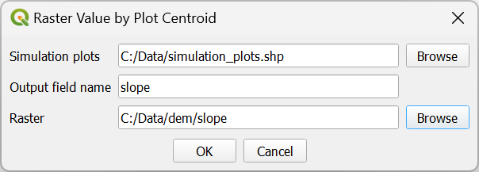

    
    <h1 style="display: inline-block; vertical-align: bottom;">GenSimPlot</h1>

    

        <b>GenSimPlot</b> is a QGIS plugin designed and developed for generating spatially optimized plots used in the simulation and analysis of geographic processes.
        Plugin enable to create squared, circular, rectangular, and eliptical plots maximazing overlap with the source polygons, enhancing the accuracy and representativeness of simulations.
    

    

        By automating plot generation, point grid creation, and raster data extraction, GenSimPlot enhances spatial analysis workflows within QGIS, making it a versatile tool for
        both research and applied geographic studies.
    

    

        GenSimPlot is designed to support a wide range of spatial analysis and simulation tasks, including:
        <ul>
            <li>Forest growth simulations.</li>
            <li>Habitat suitability simulations.</li>
            <li>Landscape planning.</li>
            <li>Environmental and ecological modeling</li>
        </ul>
    

<h2>Key Features</h2>

    <h3>Plot Shape Generation</h3>
    <ul>
        <li>Generate spatially optimized plots in square, circular, rectangular, or elliptical shapes.</li>
        <li>Configurable positioning options, including alignment with the bounding box, centroid, or mean coordinates of source polygons.</li>
        <li>Optimized placement to maximize coverage and overlap with the original polygon, improving spatial simulation outcomes.</li>
    </ul>
    <h3>Regular Point Grid Creation</h3>
    <ul>
        <li>Generate regular grids of points within each simulation plot.</li>
        <li>Configure grid density, making it suitable for high-resolution sampling within plots.</li>
        <li>Optional clipping of grid points to ensure they remain within the defined plot boundaries.</li>
    </ul>
    <h3>Raster Data Extraction</h3>
    <ul>
        <li>Extract values from environmental raster layers, such as DEM or slope, and assign these values to simulation plots or individual grid points within plots.</li>
        <li>Options to calculate aggregate statistics (e.g., mean, min, max) of raster values across grid points for each plot.</li>
    </ul>

<h2>Technical Requirements</h2>

    

        GenSimPlot is developed as a QGIS plugin and requires QGIS version 3.0 or higher to run. The plugin is written in Python and uses the PyQt5 library for the user interface.
        The plugin is compatible with Windows, macOS, and Linux operating systems.
    

<h2>Installation</h2>

    

        GenSimPlot can be installed from the QGIS Plugin Repository or by downloading the source code from the <a href="https://github.com/milan-koren/GenSimPlot" target="_blank">GitHub repository</a>.
    

    
The plugin will be available in the QGIS Vector menu after installation.

    

<h2>License</h2>

    
The plugin is licensed under the <a href="https://joinup.ec.europa.eu/collection/eupl/eupl-text-eupl-12">EUPL v1.2 (European Union Public License)</a>.

<h2>Generate Simulation Plots</h2>

    

        The <b><i>"Generate Simulation Plots"</i></b> dialog provides an interface for creating simulation plots over a selected set of polygons from an input shapefile. 
        This tool supports generating various plot shapes — such as squares, circles, rectangles, and ellipses — with configurable positioning and placement
        options to align each plot with the underlying geometry of the polygon. 
        This dialog enables flexible plot positioning based on attributes like the bounding box, centroid, and mean coordinates of each polygon. 
        Additionally, random transformations such as translations, rotations, and resizing can be applied to maximize spatial overlap with source polygons,
        improving representativeness for spatial analyses.
    

    
    
<b>Parameters:</b>

    <ul>
        <li>
            <b><i>Input shapefile:</i></b> Shapefile containing polygon features (e.g., forest stands).
        </li>
        <li>
            <b><i>Polygon ID:</i></b> Field name uniquely identifying each polygon within the input shapefile.
        </li>
        <li>
            <b><i>Output shapefile:</i></b> Path where the generated plots will be saved.
        </li>
        <li>
            <b><i>Shape:</i></b> Specifies the shape of the simulation plot. Options include square, circle, rectangle, ellipse, or “best”
            (which selects an optimized shape for maximal overlap).
        </li>
        <li>
            <b><i>Position:</i></b> Defines the initial alignment of the plot within each polygon:
            <ul>
                <li><b>Bounding Box:</b> Aligns the plot to the centroid of the bounding box.</li>
                <li><b>Centroid:</b> Centers the plot on the polygon's centroid.</li>
                <li><b>Mean Coordinates:</b> Centers the plot on the average x and y coordinates of the polygon.</li>
            </ul>
        </li>
        <li>
            <b><i>Placement:</i></b> Specifies spatial transformations to apply to the plot:
            <ul>
                <li><b>Fixed:</b> Maintains a fixed position for the plot.</li>
                <li><b>Translated:</b> Applies random translations to vary plot positioning.</li>
                <li><b>Rotated:</b> Randomly rotates the plot for orientation adjustments.</li>
                <li><b>Resized:</b> Alters the plot’s size while preserving its area.</li>
                <li><b>Optimized:</b> Iteratively adjusts position, rotation, and size to maximize overlap with the polygon.</li>
            </ul>
        </li>
    </ul>
    
Example of generated square simulation plots with optimal spatial placement for maximal overlap with source polygons:

    
    
Example of generated simulation plots optimized using the 'best' option:

    

<h2>Generate Point Grids for Simulation Plots</h2>

    

        The <b><i>"Generate Point Grids for Simulation Plots"</i></b> dialog allows users to create a regular grid of points over the bounding rectangle of each simulation plot in a selected shapefile. 
        The grid can be customized in density and alignment, with an option to clip points to fit precisely within the plot boundaries. 
        Users can select an input shapefile containing simulation plots, specify the number of points along the shorter side of the bounding rectangle to control grid density,
        and define an output shapefile to store the generated points. 
        The grid aligns with each plot’s transformation, ensuring accurate representation within simulation plot geometries.
    

    
    
<b>Parameters:</b>

    <ul>
        <li>
            <b><i>Simulation plots:</i></b> Shapefile containing polygon features representing the simulation plots.
        </li>
        <li>
            <b><i>Plot ID:</i></b> Field name that identifies each simulation plot within the input shapefile.
        </li>
        <li>
            <b><i>Output shape-file:</i></b> Path to the shapefile where the generated point grid will be saved.
        </li>
        <li>
            <b><i>Number of points:</i></b> The number of points to generate along the shorter side of each plot's bounding box, controlling the grid density.
        </li>
        <li>
            <b><i>Clip points by simulation plot:</i></b> Option to clip generated points to fit precisely within each plot's boundary, preserving spatial accuracy.
        </li>
    </ul>
    
Example of a regularly spaced point grid generated within square simulation plots:

    
    
Example of a point grid generated within simulation plots optimized using the 'best' option:

    

<h2>Raster Value Statistics by Plot Points</h2>

    

        The <b><i>"Raster Value Statistics by Plot Points"</i></b> dialog enables users to calculate summary statistics of raster values for multiple points within each simulation plot. 
        Users can specify an input shapefile containing simulation plots, a shapefile with points positioned inside each plot, and a raster file representing an environmental variable. 
        After setup, the dialog extracts raster values at each point within the plots and calculates summary statistics (minimum, maximum, and mean) for each plot. 
        These statistics are then stored in the simulation plot attribute table as new fields.
    

    
    
<b>Parameters:</b>

    <ul>
        <li>
            <b><i>Simulation plots:</i></b> Shapefile containing polygons representing the plots.
        </li>
        <li>
            <b><i>Plot ID:</i></b> Field name containing the unique identifier for each simulation plot.
        </li>
        <li>
            <b><i>Simulation plot points:</i></b> Shapefile containing point geometries located within each plot. These points are used as sampling locations for raster values.
        </li>
        <li>
            <b><i>Output field name:</i></b> Prefix for the output fields that will store calculated statistics. The prefix can be up to 5 characters. 
            In the simulation plot shapefile, the fields will be named as: <code>&lt;prefix&gt;_min</code>, <code>&lt;prefix&gt;_max</code>, and <code>&lt;prefix&gt;_mean</code>. 
            In the points shapefile, the raster values at each point location will be stored in a field with the given output field name. 
            If the specified fields do not already exist, they will be created automatically.
        </li>
        <li>
            <b><i>Raster:</i></b> Binary ArcGIS raster file containing the environmental variable to be extracted and analyzed.
        </li>
    </ul>

<h2>Raster Value by Plot Centroid</h2>

    

        The <b><i>"Extract Values By Centroid"</i></b> dialog allows users to extract raster values at the centroids of simulation plots stored in an input shapefile. 
        Users can specify both an input simulation plot shapefile and a raster file, and designate an output field where the extracted raster values will be saved in the simulation plot attribute table. 
        This dialog simplifies the assignment of spatially relevant raster data to simulation plots, enabling efficient and accurate data integration for analysis.
    

    
    
<b>Parameters:</b>

    <ul>
        <li>
            <b><i>Simulation plots:</i></b> Shapefile containing polygon geometries representing the simulation plots.
        </li>
        <li>
            <b><i>Output field name:</i></b> The name of the field to store the extracted raster value at each plot's centroid. 
            - The field name can be up to 10 characters in length. 
            - If the field exists, its values will be overwritten; otherwise, a new field will be created in the shapefile.
        </li>
        <li>
            <b><i>Raster:</i></b> The ArcGIS binary raster file containing the environmental data to be extracted.
        </li>
    </ul>

<h2>Scripting</h2>

    

        The <b><i>GenSimPlot</i></b> library provides classes and functions for automating the generation of simulation plots, creation of point grids, and extraction of raster values. 
        These tools can be executed from the QGIS Python console or integrated into custom Python workflows for streamlined spatial analysis.
    

    
Example usage of <b><i><code>GenSimPlotLib</code></i></b> classes:

    <pre>
        <code>
            from GenSimPlotLib import PlotGenerator, PointsGenerator, SimulationPlotVariables
            from GenSimPlotUtilities import GProgressDialog

            # Initialize the progress dialog
            progressDlg = GProgressDialog()
            progressDlg.show()

            # Define input parameters
            workingFolder = "c:\\data\\"
            inputShp = workingFolder + "forest_stands.shp"
            polygonID = "id"
            plotsShp = workingFolder + "plots.shp"
            pointsShp = workingFolder + "points.shp"
            nPoints = 10
            clipPoints = True
            demRaster = workingFolder + "dem\\dem"
            slopeRaster = workingFolder + "dem\\slope"

            # Generate optimized simulation plots
            plotGen = PlotGenerator()
            plotGen.generateBestPlots(inputShp, polygonID, plotsShp, progressDlg)

            # Generate a grid of points within the plots
            pointsGen = SimulationPlotVariables()
            pointsGen.generatePoints(plotsShp, polygonID, pointsShp, nPoints, clipPoints, progressDlg)

            # Extract raster values for each point within plots and calculate plot-level statistics
            rasterStats = SimulationPlotVariables()
            rasterStats.valueFromPoints(plotsShp, polygonID, pointsShp, 'elev', demRaster, progressDlg)

            # Extract raster values for each plot centroid
            rasterCentroid = SimulationPlotVariables()
            rasterCentroid.valueFromCentroid(plotsShp, 'slope', slopeRaster, progressDlg)

            # Close the progress dialog
            progressDlg.close()
        </code>
</pre>

